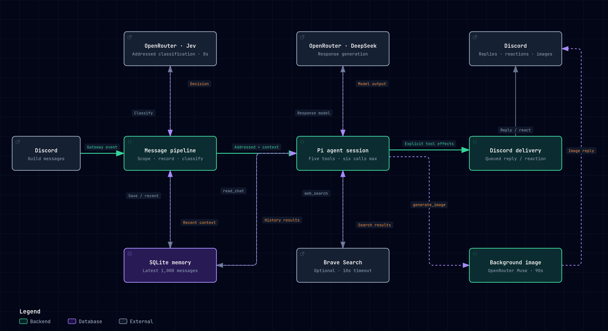

# discord-zero-bot

A small Discord bot that replies when addressed, keeps bounded message history in SQLite, searches the web, and generates images. Incoming attachments are metadata-only; their contents are not downloaded or analyzed.

## Architecture

[](docs/architecture.html)

Open `docs/architecture.html` locally for the interactive diagram; `docs/architecture.json` is its editable source.

Messages flow through scope filtering, recording, Jev classification, an isolated Pi agent session, and explicit Discord delivery. Pi can read saved channel history, search with Brave, and start background image generation.

## Run locally with Docker Compose

```bash
cp .env.example .env
# Set DISCORD_TOKEN and AI_API_KEY (OpenRouter) in .env
docker compose up -d --build
```

Enable **Message Content Intent** for the bot in the Discord Developer Portal. The bot needs access to the channels and permissions to send messages, attach files, and add reactions.

SQLite lives in the `sqlite_data` Docker volume at `/data/messages.sqlite`. For local runs, `SQLITE_PATH` defaults to `./data/messages.sqlite`; its parent directory is created automatically. The latest 1,000 messages are retained across all eligible channels, with the latest 10 used for context and older retained messages available through search.

Set `GUILD_ID` and comma-separated `CHANNEL_IDS` to restrict both recording and responses. Empty values allow all guilds/channels the bot can access. Messages from other bots are ignored; this bot's own replies are recorded for context. `BRAVE_API_KEY` enables web search.

To run without Docker:

```bash
bun install
bun --env-file=.env run start
```

## Attachment handling

Only attachment metadata (including names, types, sizes, descriptions and Discord URLs) is stored. The bot cannot read images, PDFs or audio; paste relevant content as text. No file archive, image summarization or transcription is implemented.

Image generation is separate: the prompt is sent to OpenRouter, and the generated image is posted to Discord when ready. One image task can run per channel, with a 90-second API deadline. Further image requests in that channel are rejected while it is busy; other channels and text replies continue independently. Results reply directly to Discord, not back to the Pi session. Tasks are process-local and do not survive a restart.

Text replies and reactions are sent only through explicit tools; the agent's final text is never posted. Response runs request cancellation after 120 seconds (not a guaranteed completion bound). Classification has an 8-second API timeout and web searches 10 seconds. Each response allows at most six tool calls. Generated mentions are intentionally allowed for this personal server.

## Development checks

```bash
bun install
bun run check
bun run test
```

Runtime code lives in `bot/src/`: `infra/` handles AI and SQLite, `pipeline/` orchestrates messages and delivery, and `tools/` exposes agent capabilities. Experiments live in `bot/spike/`. `bot/Dockerfile.dockerignore` excludes tests and experiments from the production build context.

Tests mock Discord and external APIs. The SQLite smoke check runs under Bun against a temporary database; no credentials are needed.
